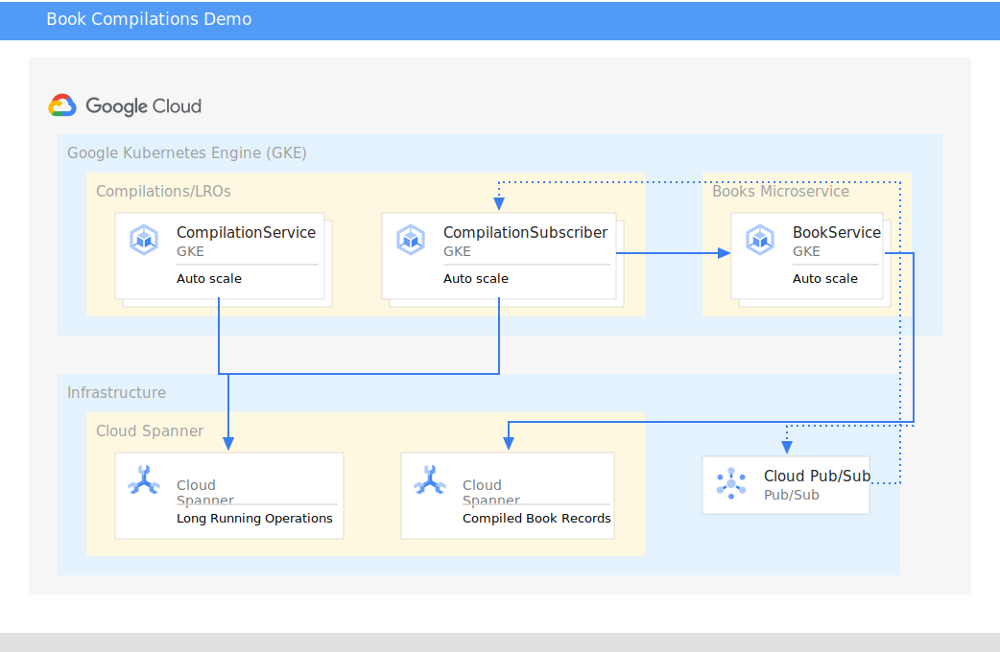
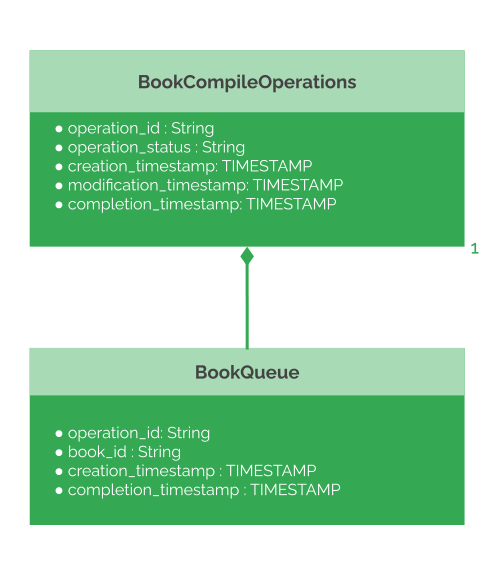

# Books Demo

The Books demo library exists primarily as a source code reference for how use
some of the standard Cloud APIs.  The library is made up of components and 
techniques meant to represent some of the best practices when coding in **Java**.

The following frameworks are used in this project:

*   Guice - [Tutorial](https://www.tutorialspoint.com/guice/index.htm)
    Used for dependency injection for modular development.
*   gRPC - [Official Documentation](https://grpc.io/)
    Used for service framework and API unification accross languages.
*   Bazel - [Official Documentation](https://bazel.build/)
    Used for building source code.
*   Docker - [Official Documentation](https://docker.com)
    Used for packaging binaries/containerization
*   Kubernetes - [Official Documentation](https://kubernetes.io/)
    Used for running docker containers.

The following Google Cloud Offerings and how they integrate with the code are
shown in the diagram below.




## Database Architecture

The system uses [Cloud Spanner](https://cloud.google.com/spanner) for its choice
of cloud databases.  One of the benefits of this is the ability to do what is known
as [table interleaving](https://cloud.google.com/spanner/docs/schema-and-data-model#parent-child)
when implementing long running operations.  I also take advantage of Spanner's
`ROW DELETION POLICY` to automate cleanup of completed LROs.  The diagram below
shows the simple layout of the tables.



## Folder Layout

Try to maintain the following layout of components so that the _Bazel_ `BUILD`
rules work as expected.

```
./[books]
├── bookservice
    ├── client                                  # Client Package - WORKSPACE root
        └── src                                 # Java source code
    ├── proto                                   # Proto Package - WORKSPACE root
        └── v1                                  # proto definitions
    ├── service                                 # Service Package - WORKSPACE root
        └── src                                 # Java source code
└── compilationservice
    ├── client                                  # Client Package - WORKSPACE root
        └── src                                 # Java source code
    ├── proto                                   # Proto Package - WORKSPACE root
        └── v1                                  # proto definitions
    ├── service                                 # Service Package - WORKSPACE root
        ├── src/.../compilationservice          # Java Server source code
        └── src/.../subscriber                  # Java Cloud Pub/Sub Subscriber source code
```

## Instance Setup

To run this demo on Google Cloud there is some pre-work required.  The following is not intended to be a tutorial on configuring GCP to run K8s.  Assuming that there is a reasonable existing familiarity with running Java Services on GKE.

### Kubernetes Cluster

* Create a new cluster with any name.

> TIP: Using an autopilot cluster is the simplest approach here for settings.


### IAM Service Accounts for Workload Identity

We have two services that will be running on GKE - `bookservice` and `compilationservice`.  For this we'll need the following IAM accounts:

*   `bookservice-workload@{{PROJECT_ID}}.iam.gserviceaccount.com`
    * **Roles:** `Cloud Spanner Database User`, `Cloud Trace Agent`, `Cloud Pub/Sub Publisher`, `Cloud Pub/Sub Subscriber`, and `Service Controller`
*   `compilationservice-workload@{{PROJECT_ID}}.iam.gserviceaccount.com`
    * **Roles:** `Cloud Spanner Database User`, `Cloud Trace Agent`, `Cloud Pub/Sub Publisher`, `Cloud Pub/Sub Subscriber`, and `Service Controller`

#### Prexisting Account Updates

* Google APIs Service Agent
    * `{{PROJECT_NUMBER}}@cloudservices.gserviceaccount.com`
        * **Roles:** `Artifact Registry Administrator`, `Service Management Administrator`, `Storage Object Admin`
* If using Google Cloud Build
    * `{{PROJECT_NUMBER}}@cloudbuild.gserviceaccount.com`
        * **Roles:** `Artifact Registry Administrator`, `Service Management Administrator`, `Storage Object Admin`, `Kubernetes Engine Developer`

### Cloud Pub/Sub (CPS)

For our CPS messages exchanged between `bookservice` and `compilationservice` we need to set up a _topic_ and a _subscription_.

*   Topic Name: `book-compilations-dev`.

>   Tip: If you wish to change this, this is configured in [Bookservice application.properties](./bookservice/service/src/main/resources/application.properties) as fallback if the Environment variable]PUBSUB_TOPIC is not found in the [bookservice deployment](./bookservice/service/gcp-configs/dev/deploy/book_service_deploy.yaml)

*   Subscription Name: `book-compilations-subscriber-dev`

>   Tip: If you wish to change this, this is configured in [Compilationservice application.properties](./compilationservice/service/src/main/resources/application.properties) as fallback if the Environment variable]PUBSUB_TOPIC is not found in the [bookservice deployment](./compilationservice/service/gcp-configs/dev/deploy/compilation_service_deploy.yaml)

### Cloud Storage (Optional)

* If the intent is to build and deploy often from the cloud using a Bazel's [Remote Caching](https://bazel.build/remote/caching#cloud-storage) is an effective way to avoid rebuilding all the targets each time.

### Artifact Registry